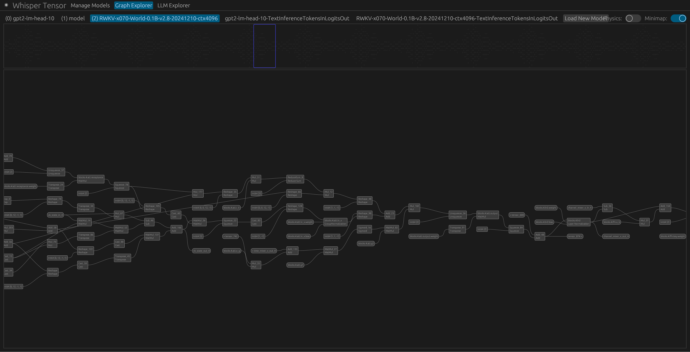

# Whisper Tensor

> **Heads-up: very early pre-alpha.** APIs, file formats, and behavior will change frequently. Please **do not depend on this project in production** yet.

Whisper Tensor is a **correctness-first** machine-learning runtime in Rust (Edition **2024**). The aim is to be a reliable **oracle** for model execution—transparent graphs, precise dtype/shape semantics, and tooling to inspect what actually happened during a run.

- **Backends**
    - **NDArray (CPU reference)** — correctness first.
    - **Vulkan** — growing op coverage; **per-op fallback** to NDArray for gaps.
- **Tests**: Both backends together currently pass **400+ official ONNX unit tests** for runtime correctness.
- **Platform**: Linux (primary/only target right now).

---

## What it does

- Uses **ONNX** as the single input language.
- Builds a **Symbolic Graph** (keeps ONNX structure and semantics; supports mixed symbolic + numeric dimensions and is open to non-ONNX ops later).
- Lowers to a **Milli-Op Graph** (decomposes complex nodes into a simpler op set; pre-execution inference resolves shapes/consts where possible).
- Executes on a chosen backend (NDArray/Vulkan today), with **operation-level fallback** when a kernel isn’t implemented on a target.

**Why:** determining the definitive “correct behavior” is often painful with existing engines. Whisper Tensor favors transparent IRs and a WebUI that lets you inspect structure and intermediate tensors (full introspection) so correctness bugs (e.g., with bf16/f16 on platforms without native primitives) can be isolated quickly.

> **ONNX opsets:** Recent ONNX nodes are the priority (≥19 recommended). Some features as new as **opset 23** (e.g., bf16) are supported. Very old, pre-10 edge cases are intentionally low priority.

---

## Super Graphs (job adapters)

**Super Graphs** describe usage patterns at the job boundary (for example, *tokens-in → logits-out* for decoder LMs). They’re small and **serde-serializable**, so the WebUI can request jobs from the server without transferring the whole model. Super Graphs adapt model-specific I/O names/layouts to a consistent job interface and provide a natural hook for optimizations that span beyond a single ONNX graph.

---

## Status snapshot

- **GPT-2** and **RWKV** both run end-to-end via the high-level Super Graph API.
- **Backends**: **NDArray** and **Vulkan** both run GPT-2 and RWKV flows correctly; Vulkan continues to expand op coverage and falls back per‑op to NDArray when needed.
- **WebUI**: supports full introspection; you can read intermediate graph tensors while running Super Graphs.

---

## Repository layout

- **`whisper-tensor`** — core library: ONNX ingest, Symbolic Graph, Milli-Op Graph, lowering, backend dispatch.
- **`crates/whisper-tensor-import`** — loaders/recipes that turn raw weights (e.g., `.safetensors`, `.pth`) into canonical **ONNX** graphs.
- **`crates/whisper-tensor-server`** — inference host (WebSocket APIs) and HTTP server for WebUI assets.
- **`crates/whisper-tensor-webui`** — WASM + egui **Graph Explorer** for navigating nested graphs and full introspection; can read intermediate graph tensors during Super Graph runs.
- **`examples/`** — up-to-date runnable samples, including GPT-2 flows using the high-level Super Graph API.
- **`tests/`** — includes the ONNX conformance harness for NDArray and Vulkan.
- **`libs/`** — vendored submodules.

---

## Build, test, run

```bash
# Build the workspace
cargo build

# Run the test suite (includes ONNX tests; Vulkan runs where enabled)
cargo test

# Optionally exercise Vulkan locally (if not enabled by default for you)
cargo test --features vulkan

# Explore current examples (GPT-2, Super Graph patterns, etc.)
ls examples
```

CI uses **lavapipe** to exercise Vulkan paths headlessly; locally you can use any Vulkan loader/runtime.

---

## Screenshots

<p align="center">
  
</p>

---

## Contributing

APIs are **highly unstable** while the architecture hardens. Bug reports—especially ONNX edge cases, dtype quirks (bf16/f16), or Vulkan coverage gaps—are very welcome. See **`examples/`** for the current API surface and usage patterns.

---

## License

Dual-licensed under **MIT** and **Apache-2.0**.