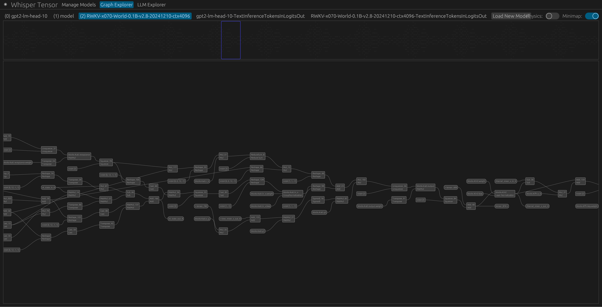

# Whisper Tensor

> **Heads-up: very early pre-alpha.** APIs, file formats, and behavior will change frequently. Please **do not depend on this project in production** yet.

Whisper Tensor is a **correctness-first** machine-learning runtime in Rust (Edition **2024**). The aim is to be a reliable **oracle** for model execution—transparent graphs, precise dtype/shape semantics, and tooling to inspect what actually happened during a run.

- **Backends**
    - **NDArray (CPU reference)** — correctness first, with optional BLAS acceleration.
    - **Vulkan** — GPU compute via custom SPIR-V kernels; **per-op fallback** to NDArray for gaps.
- **Tests**: Both backends together currently pass **2000+ official ONNX unit tests** (1008 per backend) for runtime correctness.
- **ONNX ops**: 142 operators supported. See [docs/onnx_ops.md](docs/onnx_ops.md) for the full list.
- **Platform**: Linux (primary/only target right now).

---

## What it does

```
ONNX / Safetensors / GGUF / PyTorch
           │
    ┌──────▼──────┐
    │ Symbolic     │   ONNX-level structure, mixed symbolic + numeric dims
    │ Graph        │
    └──────┬──────┘
           │  lowering
    ┌──────▼──────┐
    │ Milli-Op    │   ~30 primitive ops, shapes resolved, constants folded
    │ Graph       │
    └──────┬──────┘
           │  dispatch
    ┌──────▼──────┐
    │ Backend     │   NDArray · Vulkan · (Candle · TCH · ONNX-reference)
    └─────────────┘
```

- Uses **ONNX** as the single input language.
- Builds a **Symbolic Graph** (keeps ONNX structure and semantics; supports mixed symbolic + numeric dimensions).
- Lowers to a **Milli-Op Graph** (decomposes complex nodes into a simpler op set; pre-execution inference resolves shapes/consts where possible).
- Executes on a chosen backend with **operation-level fallback** when a kernel isn't implemented on a target.

**Why:** determining the definitive "correct behavior" is often painful with existing engines. Whisper Tensor favors transparent IRs and a WebUI that lets you inspect structure and intermediate tensors (full introspection) so correctness bugs (e.g., with bf16/f16 on platforms without native primitives) can be isolated quickly.

> **ONNX opsets:** Recent ONNX nodes are the priority (≥19 recommended). Some features as new as **opset 23** (e.g., bf16) are supported. Very old, pre-10 edge cases are intentionally low priority.

---

## Supported models

See [docs/model_roster.md](docs/model_roster.md) for detailed architecture notes and verification status.

### Text generation (LLMs)

| Model | Format | Loader |
|-------|--------|--------|
| GPT-2 | ONNX | `OnnxLoader` |
| RWKV-7 | PyTorch `.pth` | `Rwkv7Loader` |
| Llama 3 | HF Transformers / GGUF | `TransformersLoader` / `GgufLoader` |
| Gemma, Gemma 2, Gemma 3 | HF Transformers | `TransformersLoader` |
| Qwen 2 / Qwen 3 | HF Transformers / GGUF | `TransformersLoader` / `GgufLoader` |
| Phi 3 | HF Transformers / GGUF | `TransformersLoader` / `GgufLoader` |
| DeepSeek V2 | HF Transformers | `TransformersLoader` |

### Image generation

| Model | Format | Loader |
|-------|--------|--------|
| Stable Diffusion 1.5 | Single `.safetensors` | `SD15Loader` |
| Stable Diffusion 2.x | Single `.safetensors` | `SD2Loader` |
| Stable Diffusion XL | Single `.safetensors` | `SDXLLoader` |
| Stable Diffusion 3.5 | ONNX pipeline or HF Diffusers | `SD35Loader` |
| Flux (Schnell / Dev) | Single or multi-file `.safetensors` | `FluxLoader` |

### Video generation

| Model | Format | Loader |
|-------|--------|--------|
| CogVideoX (2B / 5B / 1.5-5B) | HF Diffusers | `CogVideoXLoader` |
| HunyuanVideo | HF Diffusers | `HunyuanVideoLoader` |
| LTX-Video (2B / 13B) | HF Diffusers | `LtxVideoLoader` |
| Mochi 1 | HF Diffusers | `MochiLoader` |
| Wan 2.1 (1.3B / 14B) | HF Diffusers | `WanLoader` |
| Allegro (2.8B) | HF Diffusers | `AllegroLoader` |

### Speech

| Model | Task | Format | Loader |
|-------|------|--------|--------|
| Whisper | Speech-to-text | HF Transformers | `WhisperLoader` |
| Kokoro | Text-to-speech | ONNX + voice embeddings | `KokoroLoader` |
| Piper VITS | Text-to-speech | ONNX + config JSON | `PiperLoader` |
| F5-TTS | Text-to-speech | 3-model ONNX pipeline | `F5TtsLoader` |

An `AutoLoader` auto-detects format and delegates to the appropriate loader.

---

## Super Graphs (job adapters)

**Super Graphs** describe usage patterns at the job boundary (for example, *tokens-in → logits-out* for decoder LMs, or the full diffusion denoising loop for image generation). They're small and **serde-serializable**, so the WebUI can request jobs from the server without transferring the whole model. Super Graphs adapt model-specific I/O names/layouts to a consistent job interface and provide a natural hook for optimizations that span beyond a single ONNX graph.

Six interface types are currently defined:

- **TextInference** — token context in, logits out (LLMs)
- **MultimodalLanguage** — text + vision/audio in, logits out
- **ImageGeneration** — prompts + noise in, image out (diffusion)
- **VideoGeneration** — prompts + noise in, video clip out
- **TextToSpeech** — text in, audio out
- **SpeechToText** — audio in, tokens out

---

## Repository layout

- **`whisper-tensor`** — core library: ONNX ingest, Symbolic Graph, Milli-Op Graph, lowering, backend dispatch.
- **`crates/whisper-tensor-import`** — loaders/recipes that turn raw weights (e.g., `.safetensors`, `.pth`, `.gguf`) into canonical **ONNX** graphs. Model-specific graph builders for diffusion, LLM, and speech architectures.
- **`crates/whisper-tensor-server`** — Axum + Tokio inference host with WebSocket APIs and HTTP server for WebUI assets.
- **`crates/whisper-tensor-ui`** — WASM + egui **Graph Explorer** for navigating nested graphs and full introspection; can read intermediate graph tensors during Super Graph runs. Builds to both native (GTK/Wayland) and browser (WebAssembly) targets.
- **`examples/`** — runnable samples including GPT-2, Stable Diffusion, Flux, and LLaMA flows.
- **`tests/`** — includes the ONNX conformance harness for NDArray and Vulkan.
- **`libs/`** — vendored submodules.

---

## Build, test, run

```bash
# Initialize submodules (required for ONNX test data)
git submodule update --init libs/onnx

# Build the workspace
cargo build

# Run the test suite (includes ONNX tests; Vulkan runs where enabled)
cargo test

# Run the full CI check suite locally (fmt, clippy, builds, tests, WASM)
./scripts/check-all.sh

# Optionally exercise Vulkan locally
cargo test --features vulkan
```

CI uses **lavapipe** to exercise Vulkan paths headlessly; locally you can use any Vulkan loader/runtime.

---

## Screenshots

<p align="center">
  
</p>

---

## Contributing

APIs are **highly unstable** while the architecture hardens. Bug reports—especially ONNX edge cases, dtype quirks (bf16/f16), or Vulkan coverage gaps—are very welcome. See **`examples/`** for the current API surface and usage patterns.

---

## License

Dual-licensed under **MIT** and **Apache-2.0**.
